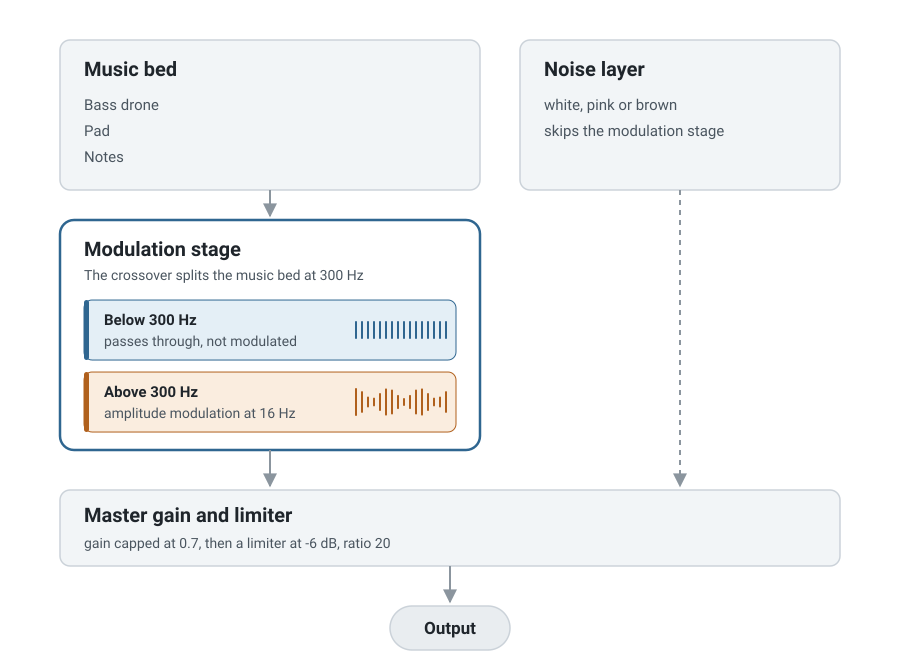

# steady

steady plays plain instrumental music. The app changes the volume of that music about 16 times a second. Engineers call this effect amplitude modulation. Researchers added the same effect to music and measured better sustained attention. The benefit was larger in people who reported more ADHD symptoms. The effect is small and the evidence is early. [What the research says](#what-the-research-says) gives the studies and their limits.

The app runs fully in your browser. You open the page and you press play. The app makes sound for as long as you want, and the sound never repeats.

**[Open steady](https://patrickt6.github.io/steady/)**

> Screenshot goes here. Replace this block with `` once the page is deployed and a screenshot has been captured.

The app needs no account, no install and no upload. It sends no network request after the page loads. The Web Audio API makes every sound on your own machine. The app streams no audio file, and the sound contains no loop.

## How to use the app

1. Open the page.
2. Press play.
3. Select a different preset if you want a different sound.

The app keeps the sliders in a panel with the title "Customize the sound". The panel is closed at the start, because most people do not open it.

The space bar starts and stops the sound. The app saves your settings in your browser. Your sound comes back the next time you press play. The app also works offline after your first visit.

## How the app makes the sound

The diagram shows the signal chain. Each block is a stage in the audio graph. Read it from the top down.

<picture>
  <source media="(prefers-color-scheme: dark)" srcset="docs/signal-chain-dark.svg">
  
</picture>

The music bed has three voices. A bass drone sits at the bottom. A pad of four voices sits above it. Single notes play over the top. All three voices use one fixed scale for the whole session. The app makes them while you listen.

The music bed then enters the modulation stage. The stage splits the signal at the crossover frequency, which is 300 Hz by default. Content below the crossover passes through steady. Content above the crossover goes through a gain that a sine controls, at 16 Hz by default.

The app splits the signal because modulation across the full band makes the bass pump. A pumping bass sounds like a tremolo pedal, and it pulls your attention to the sound.

The noise layer is separate. An AudioWorklet makes white, pink or brown noise on the audio thread. The noise joins at the master gain and skips the modulation stage. The studies modulated music, so the app modulates music only.

The master gain is capped at 0.7. A limiter follows it, with a threshold of -6 dB and a ratio of 20. The limiter is a safety device, so no combination of sliders can make a painful level in headphones.

There is more detail on each voice in [docs/how-it-works.md](docs/how-it-works.md).

## The four layers

You can turn off three of the four layers.

The music bed is generated while you listen. It has a bass drone, a sustained pad and single notes over the top. All three voices use one fixed scale for the whole session. The envelopes are long. There is no melody, no beat, no percussion and no vocals. The music bed is meant to be boring, and you should not notice it. The "Warmth" slider raises and lowers the drone and the pad together. At zero you hear the notes alone.

The modulation stage multiplies the amplitude of the music bed. You set the rate, and the default rate is 16 Hz. The stage modulates only the content above about 300 Hz.

The noise layer makes white, pink or brown noise. An AudioWorklet generates it on the audio thread, so it never glitches and never loops. The noise layer is in the app because people like it and because it has its own small evidence base. It is not what the modulation studies tested.

The headphone check is optional and the app keeps it in a closed panel. It uses the method of Woods et al. 2017. The app plays three tones, and it plays one of them out of phase between the channels. You select the quietest tone. The task is easy over headphones. Over speakers the out of phase tone cancels in the air, so you select it by mistake.

There is more detail in [docs/how-it-works.md](docs/how-it-works.md).

## What the research says

The claim behind this app is narrow. Researchers added amplitude modulation to a plain instrumental music bed, at a rate of about 16 times a second. They measured better sustained attention. The benefit was larger in people who reported more attention difficulties. The app makes no claim that music makes you smarter.

The table below grades each link in the chain. It includes the study that argues against the idea.

### The evidence table

| Claim                                                                                          | What the studies found                                                                                                                                                   | Strength    | Key citations                           |
| ---------------------------------------------------------------------------------------------- | ------------------------------------------------------------------------------------------------------------------------------------------------------------------------ | ----------- | --------------------------------------- |
| Adding amplitude modulation to music supports sustained attention                              | Modulated music produced better performance on a sustained attention task, more activity in attentional networks in fMRI, and stronger stimulus to brain coupling in EEG | Limited     | Woods et al. 2024; Woods et al. 2019    |
| The benefit is larger for people with more attention difficulties                              | Beta-range modulation helped more in participants scoring higher on ADHD symptom scales. Symptom scales, not clinical diagnosis                                          | Preliminary | Woods et al. 2024                       |
| Rhythmic sensory input entrains neural oscillations, and that entrainment relates to attention | A well established review literature on entrainment as a modifiable substrate of attention                                                                               | Moderate    | Calderone et al. 2014                   |
| Beta rhythms in particular support selective attention                                         | A computational model of interlaminar interaction. It explains why beta is the band of interest. It does not measure anyone listening to anything                        | Preliminary | Lee et al. 2013                         |
| Arousal regulation is different in ADHD, which is the rationale for stimulating it             | EEG studies find differences in cortical activity during arousal and sustained attention, and in arousal regulation in adults with ADHD. Neither study involved music    | Moderate    | Loo et al. 2009; Strauß et al. 2018     |
| People perform best at a stimulation level they choose themselves                              | Extraverts chose more intense noise than introverts, and at matched intensity introverts were more aroused. Everyone learned best at their own chosen intensity          | Limited     | Geen 1984                               |
| Background music with lyrics hurts reading and recall                                          | Pop music with lyrics reduced immediate recall for everyone, and hurt delayed recall and reading comprehension considerably more for introverts                          | Moderate    | Furnham and Bradley 1997                |
| A web page can screen for headphone use                                                        | Three tones with one presented out of phase across channels. Easy over headphones, hard over speakers because of phase cancellation                                      | Moderate    | Woods et al. 2017                       |
| Continuous noise helps attention in ADHD                                                       | A meta-analysis of 13 studies and 335 participants found a small benefit for people with ADHD or high ADHD symptoms, and impaired performance in everyone else           | Limited     | Nigg et al. 2024; Söderlund et al. 2007 |

The grades have these meanings. Moderate means multiple independent studies, or an established review literature. Limited means real experimental evidence with small samples, few replications, or a narrow scope. Preliminary means a single study, a model, or an extrapolation. Nothing here is graded Strong, because nothing here has earned that grade.

The full research discussion is in [docs/evidence.md](docs/evidence.md). It also holds a diagram of how each claim connects to its evidence grade.

### Limitations and honest caveats

The strongest results come from a small number of studies by one overlapping research group. Several of the authors are affiliated with a commercial product built on the same idea. That does not make the work wrong, but nobody independent has yet reproduced the finding.

In the 2019 study, the benefit was strongest early in the session. It did not hold up uniformly across the whole experiment.

The 2024 ADHD result used symptom questionnaires and not clinical diagnosis. "Scored high on an ADHD symptom scale" and "has ADHD" are not the same population.

Lee et al. 2013 is a computational model. It is a reason to study the beta range, and not evidence that a human listener benefited from anything.

Music with lyrics measurably hurts reading comprehension, and the effect was worse for introverts. That is why this app has no vocals of any kind. It is also why sound is a bad idea for some tasks. Silence may be better than all of this if you read something difficult.

Effect sizes across the whole literature are small. The app is not a treatment and it does not replace sleep.

**steady is not a medical device, not therapy, and not a substitute for care.** Talk to a clinician if attention causes real problems in your life.

### What we are not claiming

- That this app treats ADHD or any other condition.
- That it changes your brainwaves. You cannot feel such a change, and we cannot measure it from a web page.
- That 40 Hz gamma stimulation, which is popular in Alzheimer's research, applies to studying. That work is mostly in mice. It is about amyloid and disease pathology. Those studies do not support an extrapolation to a study session. This app ships no gamma preset.
- That binaural beats do anything. No source behind this app studies them, so the app does not include them.
- That we know your correct settings. Geen 1984 found people did best at the level they picked themselves, so the app prescribes none.
- That the benefit is large, durable or established. It is small, it is early, and part of it comes from an interested party.

### About Brain.fm

Brain.fm is a commercial product built on the same research. Several authors of the key papers are affiliated with it. steady is an open source implementation of the published results. You can read what the audio does in `src/audio/` and change it.

## Citations

1. Woods, K. J. P., Sampaio, G., James, T., Przysinda, E., Cordovez, B., Hewett, A., Spencer, A. E., Morillon, B., and Loui, P. (2024). Rapid modulation in music supports attention in listeners with attentional difficulties. _Communications Biology_, 7. https://doi.org/10.1038/s42003-024-07026-3 (an author correction was published in 2025)
2. Woods, K. J. P., Hewett, A., Spencer, A., Morillon, B., and Loui, P. (2019). Modulation in background music influences sustained attention. arXiv:1907.06909.
3. Calderone, D. J., Lakatos, P., Butler, P. D., and Castellanos, F. X. (2014). Entrainment of neural oscillations as a modifiable substrate of attention. _Trends in Cognitive Sciences_, 18(6).
4. Lee, J. H., Whittington, M. A., and Kopell, N. J. (2013). Top-down beta rhythms support selective attention via interlaminar interaction: a model. _PLoS Computational Biology_, 9(8), e1003164. https://doi.org/10.1371/journal.pcbi.1003164
5. Loo, S. K., Hale, T. S., Macion, J., Hanada, G., McGough, J. J., McCracken, J. T., and Smalley, S. L. (2009). Cortical activity patterns in ADHD during arousal, activation and sustained attention. _Neuropsychologia_, 47(10), 2114-2119.
6. Strauß, M., Ulke, C., Paucke, M., Huang, J., Mauche, N., Sander, C., Stark, T., and Hegerl, U. (2018). Brain arousal regulation in adults with attention-deficit/hyperactivity disorder. _Psychiatry Research_.
7. Geen, R. G. (1984). Preferred stimulation levels in introverts and extraverts: effects on arousal and performance. _Journal of Personality and Social Psychology_.
8. Furnham, A., and Bradley, A. (1997). Music while you work: the differential distraction of background music on the cognitive test performance of introverts and extraverts. _Applied Cognitive Psychology_, 11(5), 445-455.
9. Woods, K. J. P., Siegel, M. H., Traer, J., and McDermott, J. H. (2017). Headphone screening to facilitate web-based auditory experiments. _Attention, Perception, and Psychophysics_, 79, 2064-2072. https://doi.org/10.3758/s13414-017-1361-2
10. Nigg, J. T., Bruton, A., Kozlowski, M. B., Johnstone, J. M., and Karalunas, S. L. (2024). Systematic review and meta-analysis: do white noise or pink noise help with task performance in youth with attention-deficit/hyperactivity disorder or with elevated attention problems? _Journal of the American Academy of Child and Adolescent Psychiatry_, 63(8), 778-788. https://doi.org/10.1016/j.jaac.2023.12.014
11. Söderlund, G., Sikström, S., and Smart, A. (2007). Listen to the noise: noise is beneficial for cognitive performance in ADHD. _Journal of Child Psychology and Psychiatry_, 48(8), 840-847.
12. Brain.fm. Theory and process white paper. An industry document from a company selling a product, not peer reviewed. Listed for context and graded lowest.

## A note on the extra music voices

The drone, the pad and the slow cutoff sweep are an aesthetic choice. No research backs them, and we make no claim for them. They are in the app because one note every seven seconds sounded like a test signal.

## Development

The build needs Node 20 or newer.

```sh
npm install
npm run dev      # local dev server
npm run test     # vitest
npm run lint     # eslint and prettier
npm run build    # typecheck and production build
```

The repository has this layout:

```
src/audio/     DSP: worklet, noise, modulation, music bed, headphone check
src/presets/   named presets and settings validation
src/state/     settings types and localStorage
src/ui/        DOM wiring
public/        the AudioWorklet processor and the service worker
```

The tests cover the pure logic. That is the filter coefficients, the scale construction, the scheduler behaviour, the modulator arithmetic, the gain math and the preset validation. The tests do not cover the audio graph. A test of a `GainNode` is mostly a test of the browser.

## Contributing

Read [CONTRIBUTING.md](CONTRIBUTING.md). Two rules are worth a repeat here. A pull request that adds a claim about what this app does to your brain needs a citation. We grade that citation in the table above like every other one. We will close a pull request that adds vocals.

## License

MIT. See [LICENSE](LICENSE).
