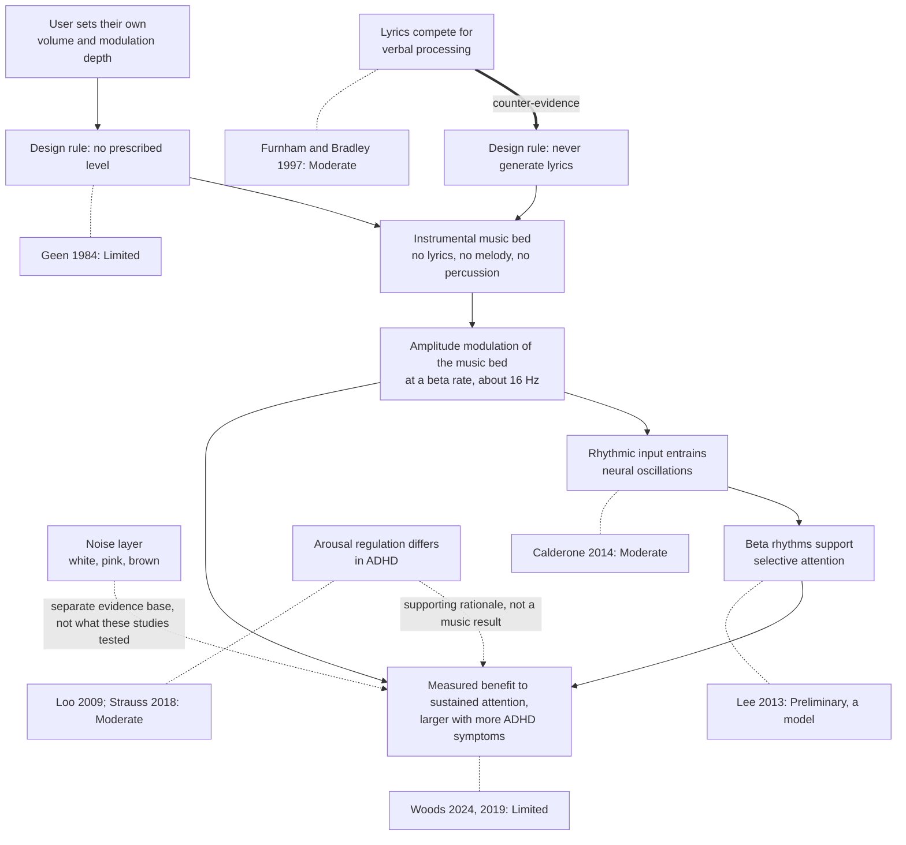

# Evidence

The long version of the research section in the README. The evidence is real, modest, early, and partly produced by people with a commercial interest. This page says so plainly.

**steady is not a medical device, not a treatment, and not a substitute for clinical care.**

## The claim this app is built on

Adding amplitude modulation to instrumental music, at a rate of roughly 16 times a second, has been measured to improve performance on sustained attention tasks. The benefit was larger in participants who reported more attention difficulties. The proposed mechanism is neural entrainment: rhythmic sensory input pulls cortical oscillations toward its own rate, and those oscillations are involved in attention.

Every part of that sentence carries a different amount of weight, which is why the table in the README grades each link separately.

## How the claims connect

The diagram maps each design decision in the app to the evidence behind it. The dotted lines say where a claim comes from and how much weight it carries. Nothing is graded Strong, because nothing here has earned that grade.

## The primary studies

### Woods et al. 2024

Woods, K. J. P., Sampaio, G., James, T., Przysinda, E., Cordovez, B., Hewett, A., Spencer, A. E., Morillon, B., and Loui, P. (2024). Rapid modulation in music supports attention in listeners with attentional difficulties. _Communications Biology_, 7. https://doi.org/10.1038/s42003-024-07026-3

Music with added amplitude modulation sustained attention better than unmodulated music. fMRI showed more activity in attentional networks. EEG showed stronger coupling between the stimulus and the brain response. Beta-range modulation helped more than other rates for participants reporting more ADHD symptoms.

What it does not show. Participants were characterised by symptom scales, not by clinical diagnosis, so this is a result about people with more attention difficulties rather than about a diagnosed ADHD population. Several authors are affiliated with a company selling modulated music. An author correction was published in 2025.

Graded **Limited** for the main effect and **Preliminary** for the ADHD-specific interaction.

### Woods et al. 2019

Woods, K. J. P., Hewett, A., Spencer, A., Morillon, B., and Loui, P. (2019). Modulation in background music influences sustained attention. arXiv:1907.06909.

Total N of 677 across experiments, using a sustained attention to response task. Adding modulation to background music improved performance.

The caveat the paper itself reports: the benefit appeared when the modulated music came early in the experiment. A result that depends on where in a session it lands is a weaker result than one that holds throughout, and it is a reason to be cautious about "listen to this for eight hours" claims. A preprint, so no journal peer review at the time of writing.

Graded **Limited**.

## The mechanism

### Calderone et al. 2014

Calderone, D. J., Lakatos, P., Butler, P. D., and Castellanos, F. X. (2014). Entrainment of neural oscillations as a modifiable substrate of attention. _Trends in Cognitive Sciences_, 18(6).

A review of the entrainment literature: rhythmic sensory input can pull neural oscillations into phase with it, and this is one of the mechanisms by which attention is allocated over time. This is the best supported link in the whole chain, and it is also the most general. It says entrainment is a real phenomenon relevant to attention. It does not say that a browser tab playing modulated pads will make your Tuesday afternoon go better.

Graded **Moderate**.

### Lee et al. 2013

Lee, J. H., Whittington, M. A., and Kopell, N. J. (2013). Top-down beta rhythms support selective attention via interlaminar interaction: a model. _PLoS Computational Biology_, 9(8), e1003164. https://doi.org/10.1371/journal.pcbi.1003164

A computational model of how beta rhythms could support selective attention through interactions between cortical layers. This is why the default rate in this app sits in the beta range rather than somewhere else.

It is a model. No human listened to anything. Treat it as a reason the beta range is worth testing, not as evidence that it works.

Graded **Preliminary**.

## The arousal rationale

Two EEG studies underpin the general idea that stimulating arousal is worth doing for people with ADHD. Neither is about music, and it matters that they are not.

Loo, S. K., Hale, T. S., Macion, J., Hanada, G., McGough, J. J., McCracken, J. T., and Smalley, S. L. (2009). Cortical activity patterns in ADHD during arousal, activation and sustained attention. _Neuropsychologia_, 47(10), 2114-2119.

Strauß, M., Ulke, C., Paucke, M., Huang, J., Mauche, N., Sander, C., Stark, T., and Hegerl, U. (2018). Brain arousal regulation in adults with attention-deficit/hyperactivity disorder. _Psychiatry Research_.

Together these support the idea that arousal regulation is different in ADHD. They are the reason an arousal-based intervention is a sensible thing to try. They are not evidence that this particular intervention works, and presenting them as though they were would be the kind of citation laundering this document exists to avoid.

Graded **Moderate** as evidence about arousal in ADHD. Not evidence about audio.

## Set your own level

Geen, R. G. (1984). Preferred stimulation levels in introverts and extraverts: effects on arousal and performance. _Journal of Personality and Social Psychology_.

Extraverts chose more intense noise than introverts when allowed to choose. At the same objective intensity, introverts were more physiologically aroused. Everyone performed best on a learning task at the intensity they had picked for themselves, and worse at someone else's preferred level.

This finding shaped the app. It is why steady has no "optimal" setting, no personalization quiz, and no claim that the default is right for you. The volume slider and the modulation depth slider exist so that you can pick your own level.

Graded **Limited**. It is an older study with a small sample by modern standards, and the introversion framing has aged unevenly. The core finding, that self-selected stimulation beats imposed stimulation, is the part this app relies on.

## The counter-evidence

Furnham, A., and Bradley, A. (1997). Music while you work: the differential distraction of background music on the cognitive test performance of introverts and extraverts. _Applied Cognitive Psychology_, 11(5), 445-455.

Ten introverts and ten extraverts did memory and reading comprehension tests in silence or with pop music playing. Immediate recall was worse with music for both groups. Delayed recall and reading comprehension were worse for introverts specifically.

This is the strongest finding in the set that argues against putting sound in your ears while you study, and it is at the front of this page rather than at the back of it. Two things follow from it.

The first is a rule the app never breaks: it generates no lyrics and no vocals of any kind. There is no speech synthesis in the codebase and there will not be.

The second is an admission. For reading comprehension in particular, silence may be the better choice, and if you are reading something hard you should try silence before you try this.

The sample was small, twenty people, and pop music with lyrics is a much stronger manipulation than a modulated ambient bed. That limits how far the result generalises to what this app produces, but it does not let the app off the hook.

Graded **Moderate**.

## The headphone check

Woods, K. J. P., Siegel, M. H., Traer, J., and McDermott, J. H. (2017). Headphone screening to facilitate web-based auditory experiments. _Attention, Perception, and Psychophysics_, 79, 2064-2072. https://doi.org/10.3758/s13414-017-1361-2

A methods paper, and the source of the optional check built into the app. Three pure tones are played; one is quieter than the others, and one of the remaining two is presented 180 degrees out of phase across the stereo channels. Over headphones each ear gets its own channel, the phase relationship is inaudible, and picking the quiet tone is easy. Over speakers the out of phase tone partly cancels in the air before it reaches you, so it sounds quietest and gets picked instead.

It is included because the modulation and the stereo placement in this app assume two separate channels reaching two separate ears. If you are on laptop speakers, some of what the app is doing is not reaching you.

Graded **Moderate** as a validated method. It is a screening tool, not a diagnosis.

## The noise layer

The noise generators in this app are not part of the modulation research. They have their own literature, which is why they are a separate section here and a secondary layer in the app.

Nigg, J. T., Bruton, A., Kozlowski, M. B., Johnstone, J. M., and Karalunas, S. L. (2024). Systematic review and meta-analysis: do white noise or pink noise help with task performance in youth with attention-deficit/hyperactivity disorder or with elevated attention problems? _Journal of the American Academy of Child and Adolescent Psychiatry_, 63(8), 778-788. https://doi.org/10.1016/j.jaac.2023.12.014

Thirteen studies, 335 participants. White and pink noise gave a small benefit on laboratory attention tasks for people with ADHD or high ADHD symptoms, and impaired performance for people without. The authors describe the positive effects as small and call for work on safe decibel levels.

Söderlund, G., Sikström, S., and Smart, A. (2007). Listen to the noise: noise is beneficial for cognitive performance in ADHD. _Journal of Child Psychology and Psychiatry_, 48(8), 840-847.

The original result behind that meta-analysis: white noise improved cognitive performance in children with ADHD and worsened it in controls.

Both graded **Limited**. Effects are small, the benefit appears to be specific to people with attention difficulties, and the same noise appears to hurt everyone else.

## The commercial document

Brain.fm publishes a "Theory and Process" white paper describing the reasoning behind its product. It is a useful summary of the same research line, and it is a marketing document from a company selling a subscription. It has not been peer reviewed. Graded lowest, and cited for context only.

## What is deliberately absent

**40 Hz gamma stimulation.** There is a well known body of work on 40 Hz sensory stimulation, largely in mouse models of Alzheimer's disease and concerned with amyloid pathology rather than with attention in healthy adults. Applying it to studying is an extrapolation those studies do not support, so this app ships no gamma preset and makes no gamma claim.

**Binaural beats.** No source in this reference set studies them. They were considered and removed rather than kept as a decorative feature, because shipping an unsupported mechanism next to a supported one lends the first the credibility of the second.

**Isochronic tones.** Same reasoning.

**Personalization.** No quiz, no profile, no adaptive engine. Geen 1984 says let the user choose, so the user chooses.
